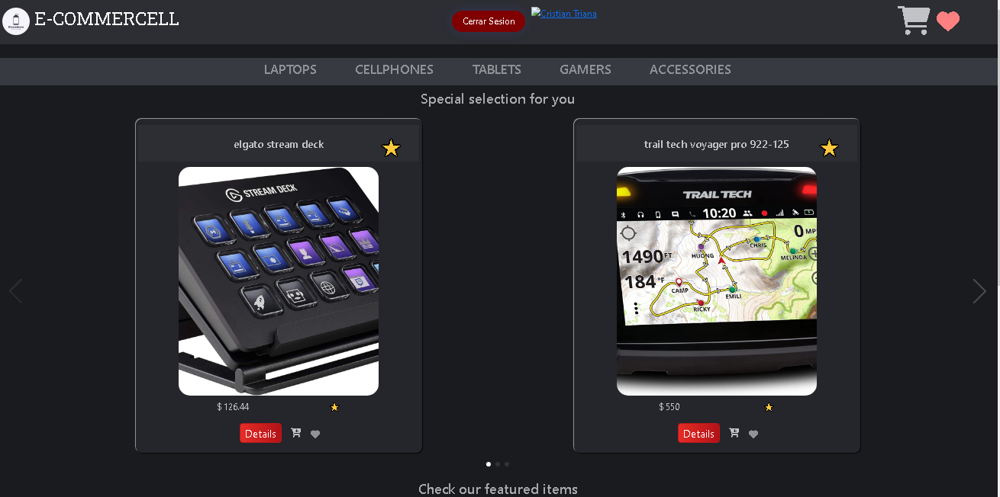
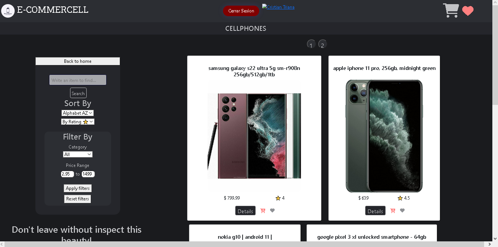
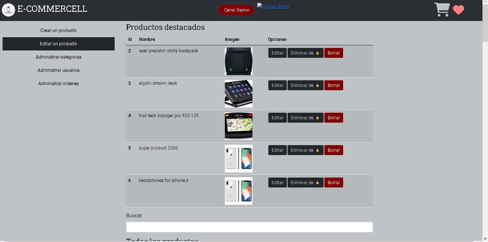
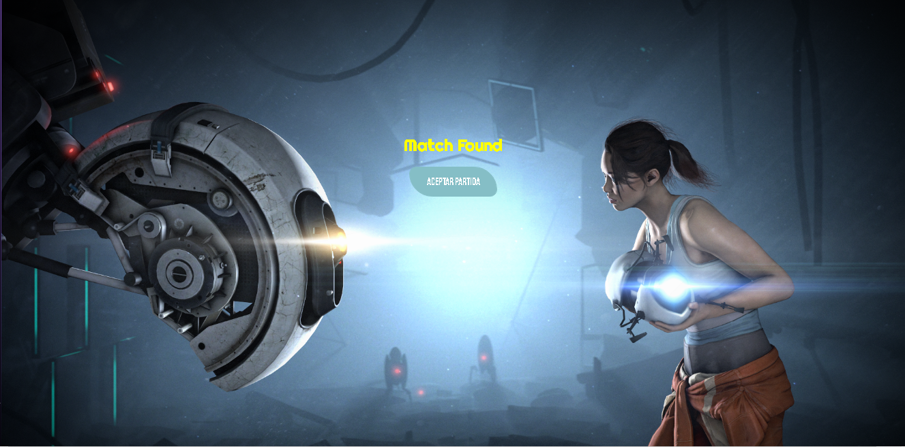
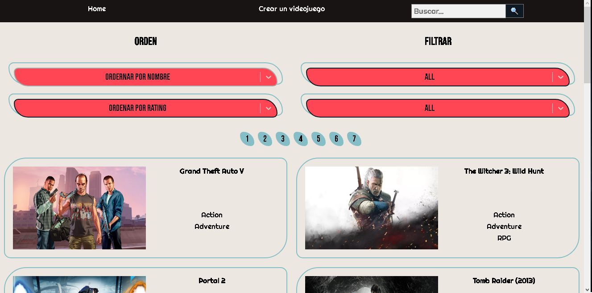
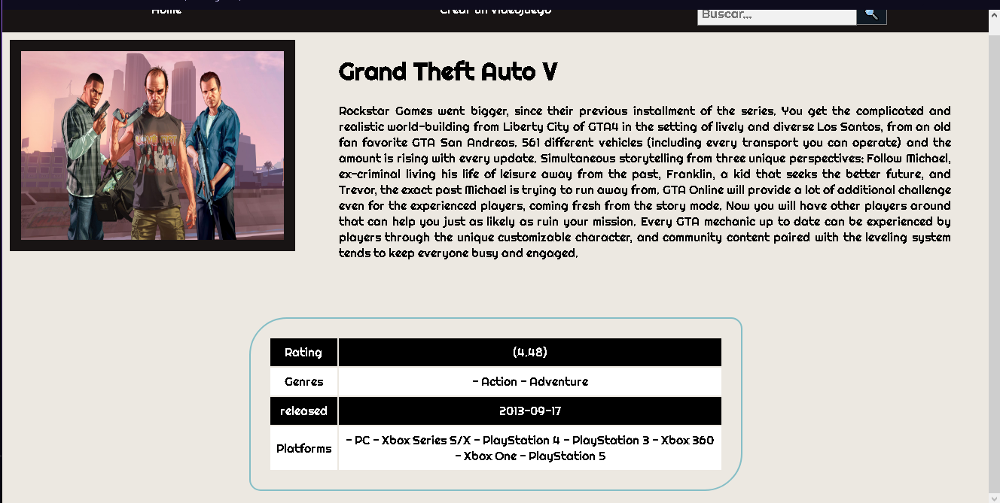

## Tabla de contenidos

1. [Acerca de mi](#acerca-de-mi)
2. [Proyectos](#proyectos)
3. [Tecnologías](#tecnologías)
4. [FAQs](#faqs)

## Acerca de mi

---

Desarrollador web especializado en Back-End, énfasis en el uso de Sequelize y JavaScript, actualmente enfocado en reforzar y mantener todos mis conocimientos en cuanto a programación pero también con grandes aspiraciones de desarrollar proyectos mucho más grandes.

## Proyectos

---

### E-COMMERCEL

#### ReactJs, Sequelize, SCSS, Auth0, PostgreSQL

Es una pagina creada para la venta de productos tecnológicos y sus diversos accesorios, es mi proyecto final para el Bootcamp realizado en Henry, con ayuda de 4 integrantes más.

El deploy del proyecto aun esta pendiente.

Screenshot

[Código](https://github.com/CristianaCTriana/ProyectoFinal)
[Deploy]

### Proyecto Individual

#### ReactJs, Sequelize, CSS, PostgreSQL

Proyecto que recrea una biblioteca de videojuegos obtenidos mediante una Api, se puede filtrar los videojuegos y crear algunos nuevos que se guardan en una base de datos local.

El Deploy aún esta pendiente.

Screenshot

[Código](https://github.com/CristianaCTriana/PI-VIDEOGAMES)
[Deploy]

## Tecnologías

---

Una lista de las tecnologías que he manejado

- [ReactJs](https://es.reactjs.org)
- [HTML](https://developer.mozilla.org/es/docs/Web/HTML)
- [CSS](https://developer.mozilla.org/es/docs/Web/CSS)
- [PostgreSQL](https://www.postgresql.org)

## Contactame

---

✉ cristianctr97@gmail.com
